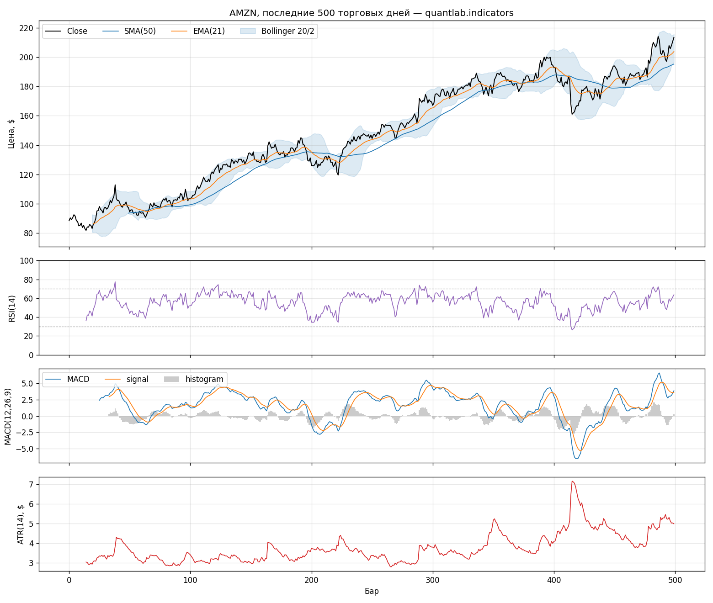

# 📐 quant-lab

> A technical-indicators library + a vectorized backtesting engine,
> written from scratch on NumPy. Fully typed, 28 unit tests against
> naive references, benchmarks, CI.

[Русская версия →](README.md)

---

## What this is

Three layers of one library:

* **`quantlab.indicators`** — 11 classic TA indicators implemented
  from the primary sources (Wilder 1978 et al.), not wrapped from an
  existing package.
* **`quantlab.backtest`** — a vectorized backtester with risk metrics
  that makes the two classic backtest lies structurally impossible
  (see "Engine honesty").
* **`quantlab.strategies`** — textbook example strategies (SMA
  crossover, RSI mean-reversion, Bollinger breakout) tying the two
  layers together.

```python
import numpy as np
from quantlab import indicators as ind
from quantlab.backtest import run_backtest, buy_and_hold

close = load_your_prices()                       # np.ndarray
fast, slow = ind.sma(close, 50), ind.sma(close, 200)
signals = np.where(fast > slow, 1.0, 0.0)        # the classic golden cross

result = run_backtest(close, signals, commission_bps=5, slippage_bps=5)
print(result.summary())
print(buy_and_hold(close).summary())             # the baseline to beat
```

## Indicators

| Group | Indicators |
|---|---|
| Trend | SMA, EMA, MACD, ADX (+DI/−DI) |
| Momentum | RSI, Stochastic (%K/%D), CCI |
| Volatility | Bollinger Bands, ATR |
| Volume | OBV, VWAP |



Shared conventions:
* warm-up values are **NaN** — never zeros or partial averages, so a
  half-warmed value can never be consumed silently;
* the Wilder family (RSI, ATR, ADX) uses ``alpha = 1/period``
  smoothing seeded with a simple mean, per the 1978 definitions;
* EMA is seeded with the SMA of the first ``span`` values (the
  charting convention).

## Engine honesty

Most homemade backtests lie in two places. The engine closes both
structurally:

1. **Lookahead bias.** A signal computed on bar `t` executes on bar
   `t+1` — the position array is the signal array shifted by one.
   Executing at signal time is impossible by construction (and there
   is a test for it).
2. **Free trading.** Every unit of position change pays
   `commission + slippage` (in bps). A long→short flip costs 1.5× a
   round trip — just like at a real broker.

Metrics: total return, CAGR, Sharpe, Sortino, max drawdown, win rate,
profit factor, exposure.

## Example: textbook strategies vs Buy & Hold

AMZN daily 2015–2024 (2497 bars), 10 bps costs per trade:

| Strategy | Total return | CAGR | Sharpe | MaxDD | Win rate | Trades |
|---|---|---|---|---|---|---|
| **Buy & Hold** | **+1282%** | **+30.3%** | **0.97** | −56.1% | — | 1 |
| SMA 50/200 crossover | +468% | +19.2% | 0.83 | **−39.6%** | 66.7% | 6 |
| RSI-14 mean reversion | +164% | +10.3% | 0.57 | −44.6% | 88.9% | 9 |
| Bollinger 20/2 breakout | +59% | +4.8% | 0.37 | −33.9% | 41.8% | 55 |


**This outcome is expected — and it is the feature.** Textbook
strategies with textbook parameters do not beat buy-and-hold on a
stock that went up 13×; the engine exists to show that honestly, not
to draw pretty curves. Note the SMA-crossover trade-off: a third of
the return given up for a 16 pp softer max drawdown — which is exactly
why trend filters are used. And the RSI strategy with an 89% win rate
earned the least: a high win rate says nothing about returns.

## Performance

1,000,000 bars, naive loop vs the vectorized implementation:

| Indicator | Naive loop | quantlab | Speedup |
|---|---|---|---|
| SMA(20) | 3.28 s | 0.013 s | **248×** |
| Bollinger(20, 2) | 13.48 s | 0.120 s | **112×** |
| Stochastic %K(14) | 3.27 s | 0.106 s | **31×** |

Honest footnote: EMA and RSI are recursive by definition
(`y[i]` depends on `y[i-1]`) and do not vectorize — they use an
explicit loop (0.3–0.8 s per million bars), with the reason documented
in the code.

## Interactive demo

```bash
streamlit run app/streamlit_app.py
```

Two tabs: **Indicators** — price with overlays (SMA/EMA/Bollinger) and
a switchable oscillator panel, every parameter a live slider;
**Backtest** — pick a strategy, tune parameters and costs, and watch
the equity curve fight buy-and-hold in real time. The demo comments on
the result honestly: even if the sliders beat Buy & Hold, that is one
asset, one period, and parameters picked in hindsight.

## Tests

34 tests; the core principle: **every vectorized implementation is
checked against a naive reference** written in the tests directly from
the textbook formula. Plus:

* a lookahead test: a signal on the last bar must not change any
  equity value;
* a hand-computed trade example with exact fee arithmetic;
* properties: RSI ∈ [0, 100], stochastic ∈ [0, 100], Bollinger bands
  ordered, warm-up lengths match the definitions.

```bash
pytest          # 34 passed
```

CI: GitHub Actions, Ubuntu/Windows × Python 3.10/3.12 matrix.

## Install & run

**1. Clone and create an environment.**

Windows (PowerShell):

```powershell
git clone https://github.com/holliholkc/quant-lab
cd quant-lab
python -m venv .venv
.\.venv\Scripts\activate
```

Linux / macOS:

```bash
git clone https://github.com/holliholkc/quant-lab
cd quant-lab
python3 -m venv .venv
source .venv/bin/activate
```

**2. Install the library with all dependencies.**

```bash
pip install -e ".[dev]"
```

This installs the `quantlab` package plus everything the tests,
examples and demo need: **pytest, pandas, matplotlib, streamlit**.
Core-only install (no demo/tests): `pip install -e .` — it pulls in
just NumPy.

**3. Run things.**

```bash
pytest                                  # tests (34 passed)
python examples/run_strategies.py      # the table and chart above
python examples/plot_indicators.py     # indicators gallery
python benchmarks/bench_indicators.py  # benchmarks
streamlit run app/streamlit_app.py     # interactive demo
```

If `streamlit` is "not recognized as a command" — step 2 ran without
`[dev]` or in a different environment; re-run `pip install -e ".[dev]"`
with the venv activated.

## Limitations & roadmap

* The engine is vector-based with all-or-nothing positions; order
  books, partial fills and margin are not modelled.
* Example strategies are textbook ones with textbook parameters.
  Finding parameters that actually work is a different job — and its
  results don't get pushed to public repositories :)
* Ideas: walk-forward optimization, a Polars backend, GPU (CuPy) for
  heavy indicator families, multi-asset portfolio mode.

## License

MIT. Indicator formulas are public knowledge; the AMZN data in the
examples comes from Kaggle (see
[amazon-stock-forecast](https://github.com/holliholkc/amazon-stock-forecast)).

⚠️ Educational project: nothing here is investment advice.
