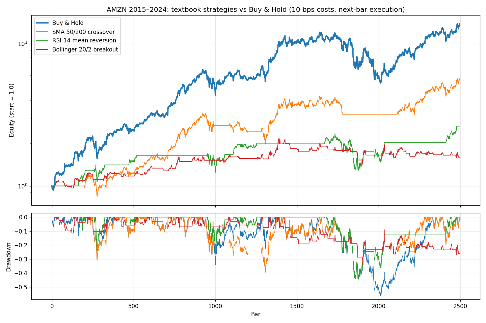

# 📐 quant-lab

> Библиотека технических индикаторов + векторизованный движок
> бэктестинга, написанные с нуля на NumPy. Полная типизация,
> 28 юнит-тестов против наивных эталонов, бенчмарки, CI.

[English version →](README.en.md)

---

## Зачем это

Два слоя одной библиотеки:

* **`quantlab.indicators`** — 11 классических индикаторов теханализа,
  реализованных по первоисточникам (Wilder 1978 и др.), а не обёрнутых
  из готовой библиотеки.
* **`quantlab.backtest`** — векторизованный движок бэктеста с
  метриками риска, который структурно не позволяет соврать
  (см. «Честность движка» ниже).

```python
import numpy as np
from quantlab import indicators as ind
from quantlab.backtest import run_backtest, buy_and_hold

close = load_your_prices()                       # np.ndarray
fast, slow = ind.sma(close, 50), ind.sma(close, 200)
signals = np.where(fast > slow, 1.0, 0.0)        # классический golden cross

result = run_backtest(close, signals, commission_bps=5, slippage_bps=5)
print(result.summary())
print(buy_and_hold(close).summary())             # бейзлайн, который надо обыграть
```

## Индикаторы

| Группа | Индикаторы |
|---|---|
| Тренд | SMA, EMA, MACD, ADX (+DI/−DI) |
| Моментум | RSI, Stochastic (%K/%D), CCI |
| Волатильность | Bollinger Bands, ATR |
| Объём | OBV, VWAP |

Конвенции, единые для всех:
* прогревочные значения — **NaN**, никогда не нули и не частичные
  средние: «полусырое» значение нельзя употребить молча;
* семейство Уайлдера (RSI, ATR, ADX) — сглаживание `alpha = 1/period`
  с затравкой простым средним, по определениям 1978 года;
* EMA затравливается SMA первых `span` значений (чартовая конвенция).

## Честность движка

Большинство самодельных бэктестов врут в двух местах. Движок закрывает
оба структурно:

1. **Lookahead bias.** Сигнал, посчитанный на баре `t`, исполняется на
   баре `t+1` — массив позиций это сигналы, сдвинутые на один бар.
   Исполнить сделку в момент расчёта сигнала невозможно по построению
   (на это есть тест).
2. **Бесплатная торговля.** Каждая единица изменения позиции платит
   `commission + slippage` (в б.п.). Разворот лонг→шорт стоит в 1.5
   раза дороже входа-выхода — как у реального брокера.

Метрики: total return, CAGR, Sharpe, Sortino, max drawdown, win rate,
profit factor, exposure — всё на одном проходе по массиву доходностей.

## Пример: книжные стратегии против Buy & Hold

AMZN, дневки 2015–2024 (2497 баров), издержки 10 б.п. на сделку:

| Стратегия | Доходность | CAGR | Sharpe | MaxDD | Win rate | Сделок |
|---|---|---|---|---|---|---|
| **Buy & Hold** | **+1282%** | **+30.3%** | **0.97** | −56.1% | — | 1 |
| SMA 50/200 crossover | +468% | +19.2% | 0.83 | **−39.6%** | 66.7% | 6 |
| RSI-14 mean reversion | +164% | +10.3% | 0.57 | −44.6% | 88.9% | 9 |
| Bollinger 20/2 breakout | +59% | +4.8% | 0.37 | −33.9% | 41.8% | 55 |



**Это ожидаемый результат, и он — фича.** Книжные стратегии с
книжными параметрами не обыгрывают buy-and-hold на акции, выросшей
в 13 раз; движок существует, чтобы это честно показывать, а не чтобы
рисовать красивые кривые. Обрати внимание на трейд-офф SMA-кроссовера:
треть доходности срезана, но и максимальная просадка мягче на 16 п.п. —
ради этого трендовые фильтры и используют. А RSI с win rate 89%
заработал меньше всех — высокий процент выигрышных сделок ничего
не говорит о доходности.

## Производительность

1 000 000 баров, наивный цикл против векторизованной реализации:

| Индикатор | Наивный цикл | quantlab | Ускорение |
|---|---|---|---|
| SMA(20) | 3.28 с | 0.013 с | **248×** |
| Bollinger(20, 2) | 13.48 с | 0.120 с | **112×** |
| Stochastic %K(14) | 3.27 с | 0.106 с | **31×** |

Честная сноска: EMA и RSI рекурсивны по определению
(`y[i]` зависит от `y[i-1]`), поэтому не векторизуются — у них
явный цикл (0.3–0.8 с на миллион баров), и в коде написано почему.

## Тесты

28 тестов, ключевой принцип — **каждая векторизованная реализация
сверяется с наивным эталоном**, написанным в тестах напрямую по
формуле из учебника. Плюс:

* тест на отсутствие lookahead: сигнал на последнем баре не влияет
  ни на одно значение эквити;
* ручной пример сделки с точной арифметикой комиссий;
* свойства: RSI ∈ [0, 100], стохастик ∈ [0, 100], полосы Боллинджера
  упорядочены, прогревочные длины совпадают с определениями.

```bash
pytest          # 28 passed
```

CI: GitHub Actions, матрица Ubuntu/Windows × Python 3.10/3.12.

## Установка и запуск

```bash
git clone https://github.com/holliholkc/quant-lab
cd quant-lab
python -m venv .venv && .\.venv\Scripts\activate
pip install -e .[dev]

pytest                                  # тесты
python examples/run_strategies.py      # таблица и график выше
python benchmarks/bench_indicators.py  # бенчмарки
```

Зависимость ядра — только NumPy. pandas/matplotlib нужны лишь для
примеров и тестов.

## Ограничения и развитие

* Движок — векторный, позиция «всё или ничего» по сигналу; стаканы,
  частичные исполнения и маржинальные требования не моделируются.
* Стратегии в примерах — учебные, с параметрами из учебников.
  Поиск работающих параметров — отдельная задача, и её результаты
  в публичные репозитории не выкладывают :)
* Идеи: walk-forward оптимизация, Polars-бэкенд, GPU (CuPy) для
  тяжёлых семейств индикаторов, портфельный режим на несколько активов.

## Лицензия

MIT. Формулы индикаторов — общественное достояние; данные AMZN в
примерах — с Kaggle (см. [amazon-stock-forecast](https://github.com/holliholkc/amazon-stock-forecast)).

⚠️ Учебный проект: ничто здесь не является инвестиционной рекомендацией.
